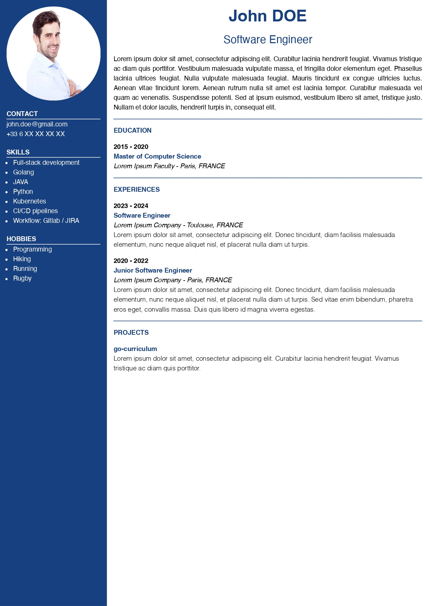

# Go curriculum
A basic CLI for generate curriculum vitae in pdf &amp; html format based from a simple yaml config file.

## Installation

Go curriculum is available on Linux, macOS and Windows platforms. Binaries for Linux, Windows and Mac are available in the release page.

> [!IMPORTANT]
> go-curriculum use chromedp module to convert html to pdf, so chrome must be installed on your machine.

* Via a G0 install

  ```bash
  go install github.com/paulcalimache/go-curriculum@latest
  ```

### Install from binaries


## CLI Usage

```bash
Usage:
  go-curriculum [flags]
  go-curriculum [command]

Available Commands:
  completion  Generate the autocompletion script for the specified shell
  help        Help about any command
  templates   List availables templates

Flags:
  -f, --file string       Yaml data file
  -h, --help              help for go-curriculum
  -o, --output string     Output directory (default "./output")
  -t, --template string   CV Template to use (default "classic")

Use "go-curriculum [command] --help" for more information about a command.
```

## Example

You can find examples under [/examples](./examples/) folder.

The following command :
```bash
go-curriculum -f examples/data.yaml -t classic
```
Will generate the following curriculum vitae :



## Roadmap

- [ ] Unit tests
- [ ] More templates